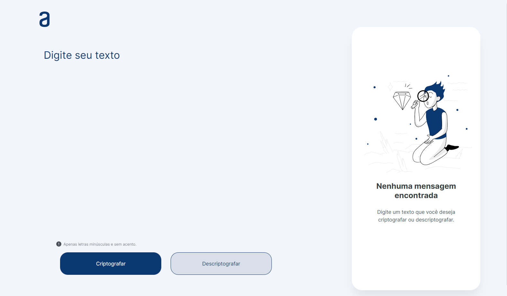

# Oracle One/Alura - Challenge Decodificador de Texto

Projeto desenvolvido no programa Oracle One, one foi desenvolvido um decodificar de texto com as seguintes regras:  
As "chaves" de criptografia que foram utilizadas são:  
A letra "e" é convertida para "enter"  
A letra "i" é convertida para "imes"  
A letra "a" é convertida para "ai"  
A letra "o" é convertida para "ober"  
A letra "u" é convertida para "ufat"  

[Clique aqui para acessar](https://antonio21machado.github.io/Decodificador-de-Texto/)

## 🛠 Tecnologias

- HTML
- CSS
-JavaScript
- Git e Github
